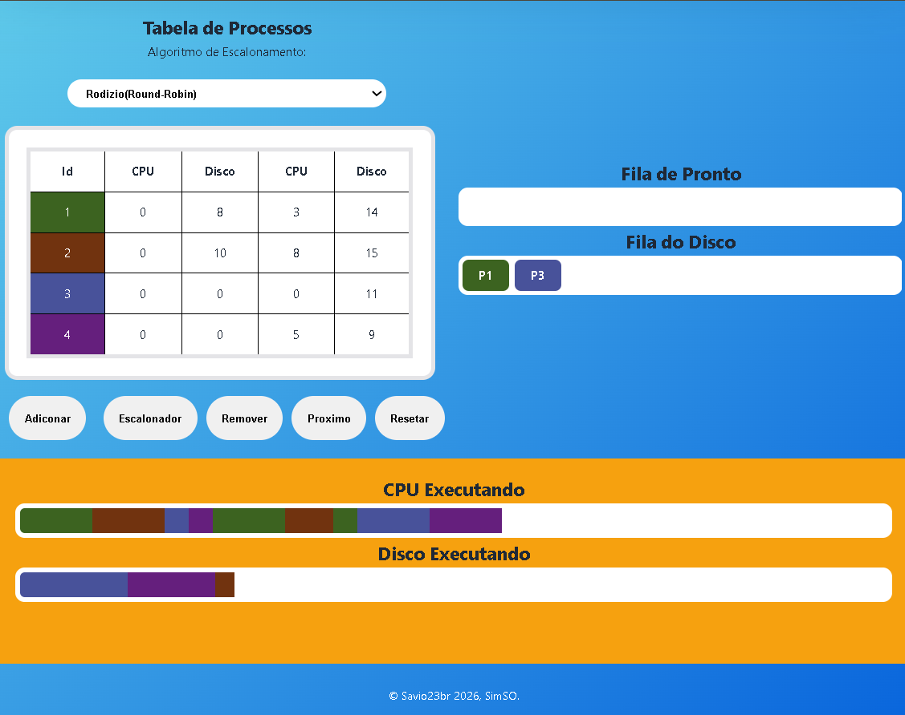

# 🖥️ SimSO - Simulador de Sistema Operacional




## 📌 Sobre o projeto

O **SimSO (Simulador de Sistema Operacional)** é uma aplicação web desenvolvida para simular o funcionamento de um escalonador de processos em um Sistema Operacional.

O objetivo do projeto é demonstrar de forma visual e interativa conceitos como **gerenciamento de processos, filas, estados de execução e algoritmos de escalonamento de CPU**.

🌐 **Acesse o simulador:**  
[SimSO - Simulador de Sistema Operacional](https://savio23br.github.io/SimSO/)

---

# 🚀 Funcionalidades

- Criação e gerenciamento de processos
- Simulação do ciclo de vida dos processos
- Controle dos estados:
  - Pronto
  - Executando
  - Bloqueado
  - Finalizado
- Simulação da CPU
- Gerenciamento de filas de processos
- Execução passo a passo utilizando temporizador
- Visualização gráfica da execução dos processos

## Algoritmos implementados

O projeto possui diferentes estratégias de escalonamento:

- **FCFS (First Come First Served)**
- **Round Robin**
- **SJF (Shortest Job First)**
- **Priority Scheduling**

---

# 🧠 Conceitos de Sistemas Operacionais aplicados

O SimSO aborda conceitos fundamentais:

- Escalonamento de CPU
- Processos e estados
- Filas de execução
- Quantum de tempo
- Gerenciamento de recursos
- Troca de contexto

---

# 🛠️ Tecnologias utilizadas

- HTML5
- CSS3
- JavaScript (ES6)
- Git/GitHub

---

# 📂 Estrutura do projeto

```
SimSO/
│
├── index.html
├── main.js
│
├── css/
│   └── style.css
│
└── js/
    │
    ├── algorithms/
    │   ├── FCFS.js
    │   ├── RoundRobin.js
    │   ├── SJF.js
    │   └── SPriority.js
    │
    ├── core/
    │   ├── estado.js
    │   ├── processo.js
    │   ├── scheduler.js
    │   └── scheUtils.js
    │
    ├── ui/
    │   ├── barras.js
    │   ├── filas.js
    │   ├── interface.js
    │   ├── navigation.js
    │   └── tabela.js
    │
    └── utils/
        ├── cores.js
        ├── helpers.js
        └── timer.js
```

---

# 🏗️ Arquitetura

O projeto foi organizado em módulos:

### 📌 Core

Responsável pela lógica principal do simulador:

- Gerenciamento do estado global
- Representação dos processos
- Controle do escalonador

### 📌 Algorithms

Contém as implementações dos algoritmos de escalonamento:

- FCFS
- Round Robin
- SJF
- Priority Scheduling

### 📌 UI

Responsável pela interface visual:

- Filas
- Tabelas
- Barras de execução
- Navegação da aplicação

### 📌 Utils

Funções auxiliares utilizadas pelo sistema:

- Temporizadores
- Manipulação de cores
- Funções genéricas

---

# ▶️ Como executar

Clone o repositório:

```bash
git clone https://github.com/Savio23br/SimSO.git
```

Entre na pasta:

```bash
cd SimSO
```

Abra o arquivo:

```
index.html
```

ou utilize a extensão **Live Server** no VS Code.

---

# 🎯 Objetivo acadêmico

Projeto desenvolvido para auxiliar no aprendizado dos conceitos de **Sistemas Operacionais**, permitindo visualizar na prática como diferentes algoritmos de escalonamento influenciam a execução dos processos.

---

# 👨‍💻 Autor

**Sávio Oliveira**

Bacharelado em Tecnologia da Informação - UFERSA

GitHub:  
[- Savio23br](https://github.com/Savio23br)
